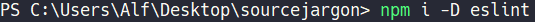
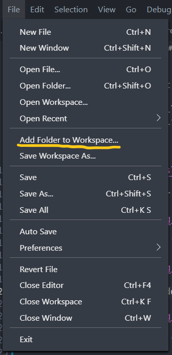
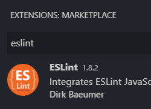
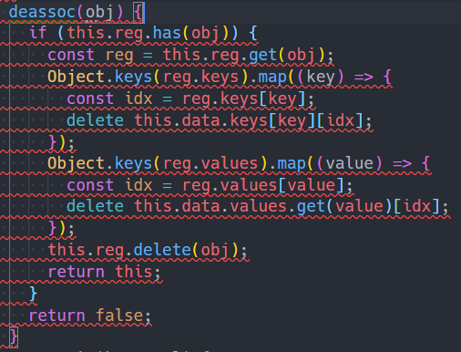
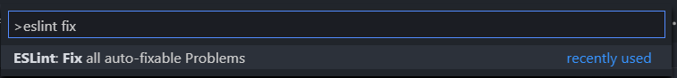
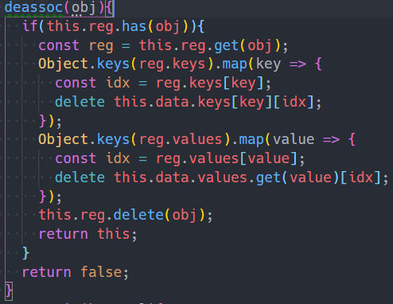
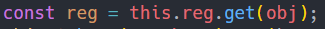

# eslint-config-j1ng3r

An ESLint config made by [me](https://github.com/Coalpha) for [Marcus](https://github.com/j1ng3r).

Warnings are suggestions.
Errors should always be followed.
This repository is not published on npm (yet).

## Installation

Download [.eslintrc.js](.eslintrc.js)

Then stick it into whatever folder that your code is in

Open cmd or powershell and `npm i -D eslint`

Open Visual Studio Code and add the directory to the workspace

Make sure that "ESLint" by "Dirk Baeumer" or similar is installed

Does your code look like this? It's probably too clean.

Press `Ctrl+Shift+P` to bring up the command pallet. Type in `eslint fix` or similar

Well, that "helped".
Unfortunately there aren't any built in rules to disable spaces on infix operators like `=`

You'll have to delete the spaces yourself.
